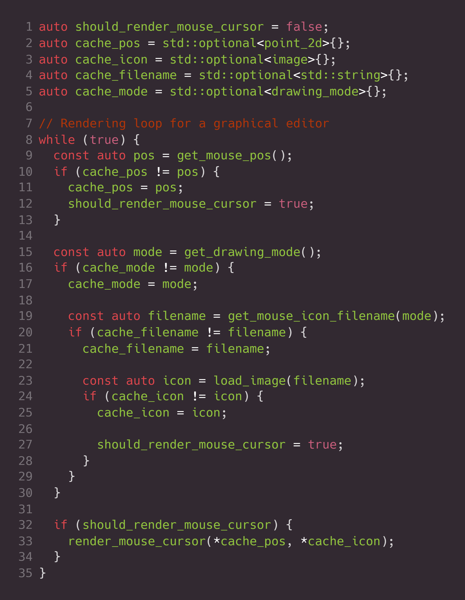

    

# Pigro
*Lazy evaluation on steroids*

A **`C++20`** library for creating reactive functions, resulting in code that is easier to reason about, easier to maintain, and less prone to errors.

Handwritten                          |        Using `pigro::lazy()`
:-----------------------------------:|:------------------------------------:
 | 

For the most up-to-date documentation, visit https://erikvalkering.github.io/pigro.
