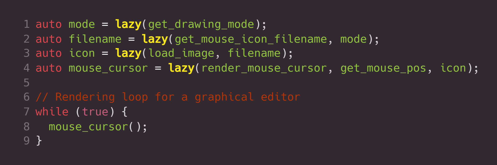

# Pigro
_Lazy evaluation on steroids_

# TL;DR
Pigro is a C++20 library that allows you to define functions in a declarative and reactive way, resulting in code that is easier to reason about, easier to maintain, and less prone to errors.

Handwritten                     |           Using Pigro
:------------------------------:|:-------------------------------:
 | 

# Features
- [x] easy creation of cached functions
- [x] reactivity by specifying dependencies
- [x] support for values, functions, and lazy functions as dependencies
- [x] skipping re-evaluation if dependencies evaluate to same values as previous ones
- [x] skipping comparison of lazy function dependencies if they were not re-evaluated
- [x] memory optimization for void functions
- [ ] memory optimization for stateless dependencies
- [ ] memory optimization for dependencies (only store cached result and any stateful transitive dependencies

# Presentations
- [LEVEL UP 2021 Rome Developer Conference](https://github.com/erikvalkering/pigro_presentation_levelup2021/releases/download/v1/presentation.pdf) ([profile page](https://levelup.aiv01.it/EN/2021/84/Erik_Valkerin/888))
