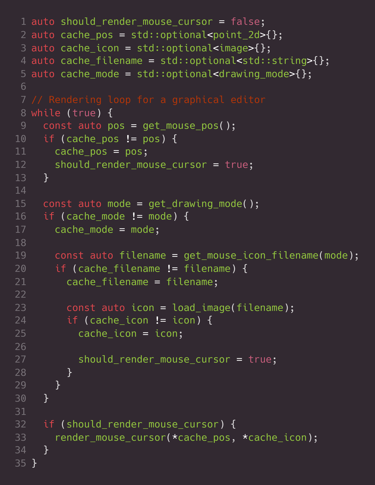
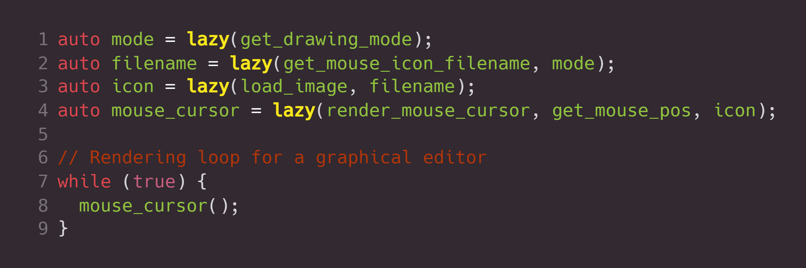

# Pigro
> Lazy evaluation on steroids

---
A **`C++20`** library for creating reactive functions, resulting in code that is easier to reason about, easier to maintain, and less prone to errors.

Handwritten                     |           Using Pigro
:------------------------------:|:-------------------------------:
 | 

[Features](#features)
